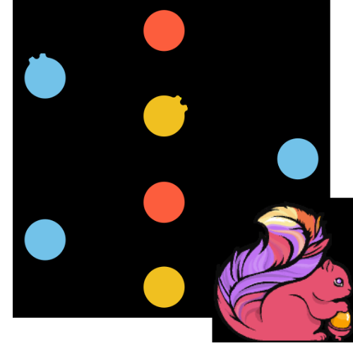

<h1 style="text-align: center;"> NeuroFlinkCEP: Neurosymbolic Complex Event Recognition Optimized across IoT Platforms</h1>


Repository Contents:
- **neuroflinkcep-rapidminer-extension-streaming** : this is the Streaming Extension, developed by RapidMiner and made available at its MarketPlace, extended to support the NeuroFlinkCep operator and the DAGStar4CER-Optimizer.
- **DAG*4CER-optimizer**: the implementation of the DAG*4CER optimization engine

- **Robotic-Scenario**: the dataset and code used to train the neural model for the robotic scenario, as well as the trained model, ready to be loaded

- **data/**: contains the datasets, used for training and testing reasons


# NeuroFlinkCEP Rapid Miner Extension
## Version
The following versions are used throughout the project:

- **Flink** 1.9.2  
- **RapidMiner** 9.10.0  
- **Java** 1.8  
- **Gradle** 6.7.0  

## How to Use

1. Run the `installExtension` Gradle task (inside rapidminer extension module) to build and install the extension

2. Launch RapidMiner Studio and verify that the NeuroFlinkCEP operator appears in your list of extensions.

# DAG*4CER Optimizer
## Version
The following runtimes and tools are required:

- **Java** 11 or 17  
- **Maven** 
- **Docker Compose** (to orchestrate the optimizer, Kibana, and Elasticsearch)

## How to Use

1. From the `DAGStar4CER-optimizer` root directory, run:  
   ```bash
   mvn package
2. Start all services with Docker Compose
    ```bash
    docker-compose up
3. Once up, verify that:

* The optimizer container is running and processing workflows at http://localhost:8080

* Kibana is accessible at http://localhost:5601
using  
**username**: "elastic"  
**password**: "elastic123"

# Robotic-Scenario 
## Version
- **Python** 3.7
- **TensorFlow** 1.15

## How to use 

### Training

1. Create and activate a virtual environment, then install dependencies:  
   ```bash
   python3 -m venv venv
   source venv/bin/activate
   pip install -r requirements.txt
   
2. Run the training script, that uses `label_encoder_goal_status` as label encoder, `scaler.pkl` as feature scaler and `smart_factory_with_collisions_100_robots-split.csv` as dataset.

> **Note:**
> - The `trained_model/` directory contains the already trained model


# Robot Dataset

### Dataset Description

The `smart_factory_with_collisions_100_robots.csv` file contains one row per robot per time step:

| Column               | Type    | Description                                                     |
| -------------------- | ------- | --------------------------------------------------------------- |
| `robotID`            | Integer | Unique identifier for each robot                                |
| `current_time`       | Float   | Simulation timestamp in seconds                                 |
| `current_time_step`  | Integer | Time‐step index                                        |
| `px`, `py`, `pz`     | Float   | X, Y, Z position coordinates (in meters)                        |
| `vx`, `vy`           | Float   | Velocity components along X and Y axes (m/s)                    |
| `goal_status`        | String  | Current status or event label ( `collision detected`, `stopped at station [0-9]`, stopped unknown, `moving to station [0-9]`)       |
| `idle`               | Bool    | `True` if the robot is idle                                     |
| `linear`             | Bool    | `True` if the robot is in linear motion                         |
| `rotational`         | Bool    | `True` if the robot is rotating                                 |
| `Deadlock_Bool`      | Bool    | `True` if the robot is in a deadlock condition                  |
| `RobotBodyContact`   | Bool    | `True` if the robot’s body is in contact with another object    |

> **Note:**  
> The full dataset exceeds GitHub’s file size limits, so only a demo subset is included here.  
> You can download the complete dataset [from this link](https://drive.google.com/drive/folders/1AiMMuz9jVUP3Va5wRs3js3RJ9jfiSwF2?usp=drive_link).  

